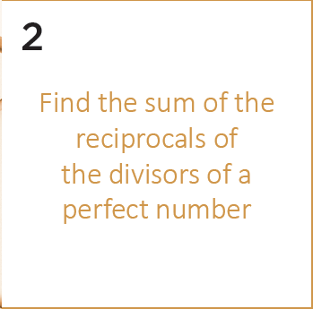
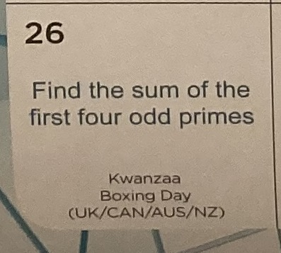

# Daily_Epsilon

In this folder, I will try to solve Math problems from:

- https://twitter.com/Daily_Epsilon

## Gitpod

[](https://gitpod.io/#https://github.com/jabrena/daily-epsilon)

## 2022/01/09


```
jbang Problem20220109.java
```

## 2022/01/06


```
jbang Problem20220106.java
```

## 2022/01/02



```
jbang Problem20220102.java
```

## 2022/01/01


```
jbang Problem20220101.java
```

---

## 2021/12/31


```
jbang Problem20211231.java
```

## 2021/12/29


```
jbang Problem20211229.java
```

## 2021/12/28


```
jbang Problem20211228.java
```

## 2021/12/27


```
jbang Problem20211227.java
```

## 2021/12/26



```
jbang Problem20211226.java
```

## 2021/12/24


```
jbang Problem20211224.java
```
