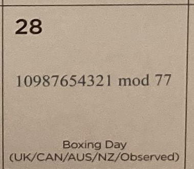

# Daily_Epsilon

In this folder, I will try to solve Math problems from:

- https://twitter.com/Daily_Epsilon

## Gitpod

[](https://gitpod.io/#https://github.com/jabrena/daily-epsilon)

## How to run in local?

```
sdk install jbang

mvn clean verify

jbang Problem20220110.java
mvn compile exec:java -Dexec.mainClass="edu.jab.math.Problem20220110"
```

## 2022/02/19


```
jbang Problem20220219.java
```

## 2022/02/05


```
jbang Problem20220205.java
```

## 2022/01/31


```
jbang Problem20220131.java
```

## 2022/01/30


```
jbang Problem20220130.java
```

## 2022/01/29


```
jbang Problem20220129.java
```

## 2022/01/28


```
jbang Problem20220128.java
```

## 2022/01/25


```
jbang Problem20220125.java
```

## 2022/01/23


```
jbang Problem20220123.java
```

## 2022/01/13


```
jbang Problem20220111.java
```

## 2022/01/11


```
jbang Problem20220111.java
```


## 2022/01/10


```
jbang Problem20220110.java
```

## 2022/01/09


```
jbang Problem20220109.java
```

## 2022/01/06


```
jbang Problem20220106.java
```

## 2022/01/02


```
jbang Problem20220102.java
```

## 2022/01/01


```
jbang Problem20220101.java
```

---

## 2021/12/31


```
jbang Problem20211231.java
```

## 2021/12/29


```
jbang Problem20211229.java
```

## 2021/12/28



```
jbang Problem20211228.java
```

## 2021/12/27


```
jbang Problem20211227.java
```

## 2021/12/26


```
jbang Problem20211226.java
```

## 2021/12/24


```
jbang Problem20211224.java
```
